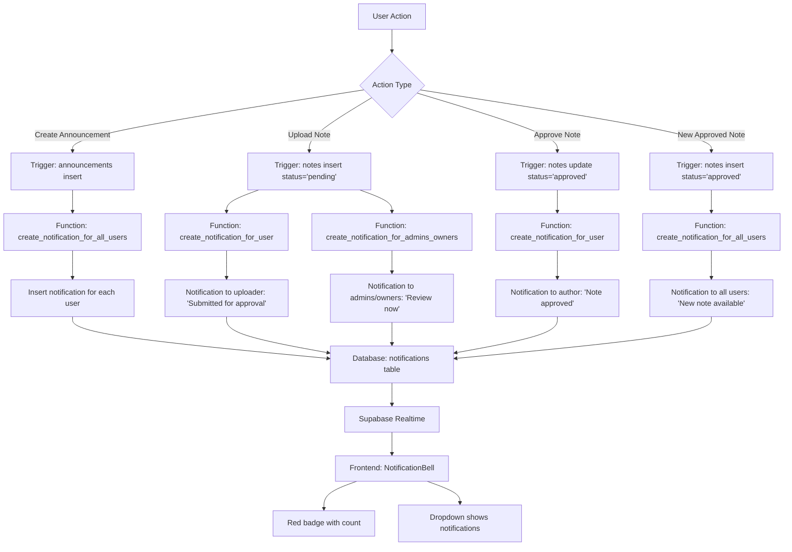

# Notification System Design

## Current State Analysis

### Database Schema
- **Table**: `notifications` (350 rows)
- **Columns**: 
  - `id` (uuid, primary key)
  - `user_id` (uuid, foreign key to auth.users)
  - `type` (text, with check constraint for 8 types)
  - `title` (text)
  - `message` (text)
  - `data` (jsonb, default '{}')
  - `is_read` (boolean, default false)
  - `created_at` (timestamptz, default now())
  - `read_at` (timestamptz, nullable)

### Notification Types (Existing)
1. `note_uploaded` - User uploaded a note
2. `note_approved` - Note was approved
3. `note_rejected` - Note was rejected
4. `new_note_in_course` - New note posted in a course
5. `system` - System notifications
6. `announcement` - Announcements
7. `note_pending_review` - Note needs review
8. `badge` - Badge earned

## Requirements

### User Requirements
1. **Notification Bell Icon**: Bell icon with red circle showing unread count
2. **Real-time Sync**: Notifications appear instantly without page refresh
3. **Specific Triggers**:
   - New announcement → all users get notified
   - User uploads a note → user gets "submitted for approval" notification
   - Note approved → author gets notification
   - New note posted → all members (active/inactive) get notified
   - User uploads note for approval → admins/owners get "review now" button notification
4. **Non-invasive**: Don't affect other functionality

## Architecture Design

### 1. Database Layer

#### New Functions Needed:
1. `create_notification_for_user(user_id, type, title, message, data)` - Creates notification for single user
2. `create_notification_for_all_users(type, title, message, data)` - Creates notification for all users
3. `create_notification_for_admins_owners(type, title, message, data)` - Creates notification for admins/owners
4. `get_unread_notification_count(user_id)` - Returns count of unread notifications
5. `mark_notification_as_read(notification_id)` - Marks notification as read
6. `mark_all_notifications_as_read(user_id)` - Marks all user notifications as read

#### Triggers Needed:
1. **Announcement Trigger**: When new row inserted in `announcements` table
2. **Note Upload Trigger**: When new row inserted in `notes` table with status='pending'
3. **Note Approval Trigger**: When `notes.status` changes from 'pending' to 'approved'
4. **New Note Trigger**: When new row inserted in `notes` table with status='approved'

### 2. Backend Service Layer

#### Notification Service (`src/services/notificationService.ts`)
- Methods:
  - `getNotifications(userId, limit, offset)`
  - `getUnreadCount(userId)`
  - `markAsRead(notificationId)`
  - `markAllAsRead(userId)`
  - `subscribeToNotifications(userId, callback)` - Real-time updates

#### Real-time Integration:
- Use Supabase Realtime to subscribe to `notifications` table changes
- Filter by `user_id = current_user_id`
- Trigger UI updates when new notifications arrive

### 3. Frontend Components

#### Notification Context (`src/contexts/NotificationContext.tsx`)
- Manages notification state globally
- Provides:
  - `notifications`: Array of notifications
  - `unreadCount`: Number of unread notifications
  - `markAsRead`: Function to mark notification as read
  - `markAllAsRead`: Function to mark all as read
  - `refreshNotifications`: Function to refresh notifications

#### Notification Bell Component (`src/components/NotificationBell.tsx`)
- Bell icon with badge showing unread count
- Click opens notification dropdown
- Real-time updates via context

#### Notification Dropdown (`src/components/NotificationDropdown.tsx`)
- Shows list of notifications (latest first)
- Each notification shows:
  - Icon based on type
  - Title
  - Message (truncated)
  - Time ago
  - Read/unread indicator
- "Mark all as read" button
- "View all" link to notifications page

#### Notifications Page (`src/pages/NotificationsPage.tsx`)
- Full page showing all notifications
- Filter by read/unread
- Pagination
- Bulk actions (mark all as read, delete)

### 4. Integration Points

#### App Integration:
- Add `NotificationProvider` to `App.tsx`
- Update `TopNav` to include `NotificationBell` component
- Add notification triggers to existing pages:
  - `OwnerDashboard.tsx` - Announcement creation
  - `UploadPage.tsx` - Note upload
  - `AdminPending.tsx` - Note approval/rejection

## Implementation Plan

### Phase 1: Database Foundation
1. Create database functions for notification management
2. Create triggers for automatic notification generation
3. Test database functions with sample data

### Phase 2: Backend Services
1. Create `notificationService.ts`
2. Implement real-time subscription
3. Create TypeScript types for notifications

### Phase 3: Frontend Context & Components
1. Create `NotificationContext.tsx`
2. Create `NotificationBell.tsx`
3. Create `NotificationDropdown.tsx`
4. Create `NotificationsPage.tsx`

### Phase 4: Integration
1. Add `NotificationProvider` to `App.tsx`
2. Update `TopNav.tsx` to include notification bell
3. Add notification triggers to existing features

### Phase 5: Testing & Polish
1. Test all notification triggers
2. Test real-time updates
3. Test mobile responsiveness
4. Add loading states and error handling

## Security Considerations

1. **RLS Policies**: Ensure `notifications` table has proper RLS policies
   - Users can only read their own notifications
   - Users can only update `is_read` and `read_at` fields
   - Only server-side functions can insert notifications

2. **Data Privacy**: Notification data should not expose sensitive information

3. **Rate Limiting**: Consider rate limiting for notification creation

## Performance Considerations

1. **Indexing**: Add indexes on `notifications(user_id, created_at DESC)` and `notifications(user_id, is_read)`
2. **Pagination**: Implement pagination for notifications list
3. **Real-time Optimization**: Use Supabase Realtime efficiently
4. **Caching**: Consider caching unread count

## Mermaid Diagram: Notification Flow

## Next Steps

1. Review this design with the user
2. Get approval for implementation approach
3. Begin implementation in Code mode