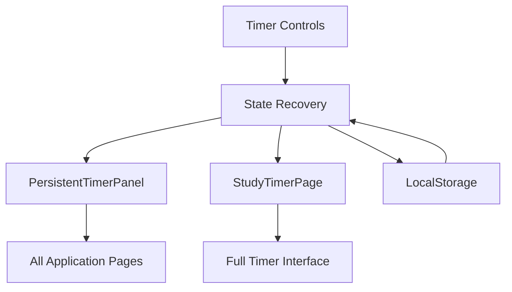

# Pomodoro/Study Timer Feature - Comprehensive Implementation Plan

## Overview
A Pomodoro/Study Timer feature with a persistent timer panel that stays visible across all pages, allowing students to track study sessions while navigating the platform.

## Core Requirements

### 1. Timer Functionality
- **Pomodoro Technique**: 25 minutes work, 5 minutes break (standard)
- **Customizable Durations**: Users can adjust work/break times
- **Session Tracking**: Count completed Pomodoro sessions
- **Timer Controls**: Start, pause, stop, reset, skip
- **Notifications**: Visual and audio alerts for session transitions
- **Auto-advance**: Automatically switch between work/break sessions

### 2. Persistent Timer Panel
- **Always Visible**: Small panel that stays on screen across all pages
- **Minimalist Design**: Compact display showing current timer status
- **Collapsible**: Can be minimized to a small icon when not needed
- **Positioning**: Fixed position (bottom-right corner by default)
- **Mobile Responsive**: Adapts to different screen sizes

### 3. User Experience
- **Session Persistence**: Timer continues running even when switching pages
- **State Recovery**: If page reloads, timer state is restored
- **Progress Visualization**: Visual indicators of time remaining
- **Session History**: Track daily/weekly study time
- **Goals & Statistics**: Set daily Pomodoro goals and view statistics

## System Architecture

### 1. Component Structure
```
src/
├── components/
│   ├── StudyTimer/           # Main timer component
│   │   ├── StudyTimer.tsx    # Full-screen timer page
│   │   ├── TimerControls.tsx # Start/stop/pause buttons
│   │   ├── TimerDisplay.tsx  # Time display component
│   │   └── TimerSettings.tsx # Duration settings
│   ├── PersistentTimerPanel/ # Persistent panel
│   │   ├── PersistentTimerPanel.tsx
│   │   ├── MiniTimer.tsx     # Collapsed/minimized view
│   │   └── TimerPanelContext.tsx
│   └── ui/
│       └── timer-card.tsx    # Shared timer UI components
├── contexts/
│   └── TimerContext.tsx      # Global timer state management
├── hooks/
│   └── useTimer.ts           # Custom timer hook
├── services/
│   └── timerService.ts       # Timer logic and utilities
└── pages/
    └── StudyTimerPage.tsx    # Dedicated timer page
```

### 2. State Management
- **TimerContext**: React Context for global timer state
- **Local Storage**: Persist timer state across page reloads
- **Session Storage**: Temporary timer state for current session

### 3. Data Flow


## Database Schema (Optional - For Statistics)

### 1. Basic Schema (If tracking study statistics)
```sql
-- Study sessions table (optional enhancement)
CREATE TABLE study_sessions (
  id UUID PRIMARY KEY DEFAULT gen_random_uuid(),
  user_id UUID REFERENCES auth.users(id) ON DELETE CASCADE,
  session_type VARCHAR(20) NOT NULL CHECK (session_type IN ('work', 'break', 'long_break')),
  duration_seconds INTEGER NOT NULL,
  start_time TIMESTAMPTZ NOT NULL DEFAULT NOW(),
  end_time TIMESTAMPTZ,
  notes TEXT,
  created_at TIMESTAMPTZ DEFAULT NOW()
);

-- User study statistics (optional)
CREATE TABLE user_study_stats (
  user_id UUID PRIMARY KEY REFERENCES auth.users(id) ON DELETE CASCADE,
  total_study_seconds BIGINT DEFAULT 0,
  total_pomodoros INTEGER DEFAULT 0,
  daily_goal INTEGER DEFAULT 8, -- 8 pomodoros = 4 hours
  updated_at TIMESTAMPTZ DEFAULT NOW()
);
```

### 2. Local Storage Schema (Primary Implementation)
```typescript
interface TimerState {
  isRunning: boolean;
  isPaused: boolean;
  currentSession: 'work' | 'break' | 'long_break';
  timeRemaining: number; // in seconds
  workDuration: number; // in minutes
  breakDuration: number; // in minutes
  longBreakDuration: number; // in minutes
  sessionsCompleted: number;
  totalStudyTime: number; // in seconds
  startTime: number | null; // timestamp when timer started
}
```

## Detailed Component Architecture

### 1. TimerContext.tsx - Global State Management
```typescript
// Core timer state
interface TimerState {
  isRunning: boolean;
  isPaused: boolean;
  currentSession: 'work' | 'short_break' | 'long_break';
  timeRemaining: number; // seconds
  sessionsCompleted: number;
  totalStudyTime: number; // seconds
  
  // Settings
  workDuration: number; // minutes
  shortBreakDuration: number; // minutes
  longBreakDuration: number; // minutes
  longBreakInterval: number; // sessions before long break
  autoStartBreaks: boolean;
  autoStartWork: boolean;
  soundEnabled: boolean;
  notificationsEnabled: boolean;
  
  // Session tracking
  currentSessionStartTime: number | null;
  sessionHistory: SessionRecord[];
}

// Session record for history
interface SessionRecord {
  id: string;
  type: 'work' | 'short_break' | 'long_break';
  duration: number;
  startTime: number;
  endTime: number;
  notes?: string;
}

// Context value
interface TimerContextValue extends TimerState {
  // Actions
  startTimer: () => void;
  pauseTimer: () => void;
  stopTimer: () => void;
  resetTimer: () => void;
  skipSession: () => void;
  toggleTimer: () => void;
  
  // Settings
  updateSettings: (settings: Partial<TimerSettings>) => void;
  resetSettings: () => void;
  
  // Session management
  addSessionNote: (note: string) => void;
  clearHistory: () => void;
  
  // Statistics
  getDailyStats: () => DailyStats;
  getWeeklyStats: () => WeeklyStats;
  getSessionProgress: () => number; // 0-100%
}
```

### 2. PersistentTimerPanel.tsx - Detailed Design

**Expanded View (Desktop):**
```tsx
<div className="fixed bottom-6 right-6 w-80 bg-surface border border-border rounded-xl shadow-2xl z-[1000] overflow-hidden">
  {/* Header */}
  <div className="p-4 border-b border-border/50 bg-gradient-to-r from-primary/5 to-transparent">
    <div className="flex items-center justify-between">
      <div className="flex items-center gap-2">
        <div className="h-3 w-3 rounded-full bg-primary animate-pulse"></div>
        <span className="font-semibold text-sm">Study Timer</span>
      </div>
      <div className="flex items-center gap-1">
        <button className="p-1 hover:bg-surface2 rounded" onClick={toggleMinimize}>➖</button>
        <button className="p-1 hover:bg-surface2 rounded" onClick={openFullTimer}>⏱️</button>
        <button className="p-1 hover:bg-surface2 rounded" onClick={stopTimer}>⏹️</button>
      </div>
    </div>
  </div>
  
  {/* Timer Display */}
  <div className="p-4">
    <div className="text-center mb-3">
      <div className="text-3xl font-mono font-bold text-foreground">
        {formatTime(timeRemaining)}
      </div>
      <div className="text-sm text-muted-foreground mt-1">
        {currentSession === 'work' ? 'Work Session' :
         currentSession === 'short_break' ? 'Short Break' : 'Long Break'}
      </div>
    </div>
    
    {/* Progress Bar */}
    <div className="h-2 bg-surface2 rounded-full overflow-hidden mb-4">
      <div
        className="h-full bg-primary transition-all duration-1000"
        style={{ width: `${sessionProgress}%` }}
      ></div>
    </div>
    
    {/* Controls */}
    <div className="flex gap-2">
      <button
        className="flex-1 py-2 rounded-lg bg-primary text-primary-foreground font-medium hover:opacity-90"
        onClick={toggleTimer}
      >
        {isRunning ? 'Pause' : 'Start'}
      </button>
      <button
        className="py-2 px-4 rounded-lg border border-border hover:bg-surface2"
        onClick={skipSession}
      >
        Skip
      </button>
    </div>
    
    {/* Session Info */}
    <div className="mt-3 text-xs text-muted-foreground flex justify-between">
      <span>Session {sessionsCompleted + 1}/4</span>
      <span>Today: {formatTime(totalStudyTime)}</span>
    </div>
  </div>
</div>
```

**Minimized View:**
```tsx
<div className="fixed bottom-6 right-6 bg-surface border border-border rounded-full shadow-lg z-[1000] overflow-hidden">
  <div className="flex items-center gap-2 px-3 py-2">
    <div className={`h-2 w-2 rounded-full ${isRunning ? 'bg-primary animate-pulse' : 'bg-muted'}`}></div>
    <span className="font-mono text-sm font-medium">
      {formatTime(timeRemaining)}
    </span>
    <button className="p-1 hover:bg-surface2 rounded" onClick={toggleMinimize}>
      {isMinimized ? '➕' : '➖'}
    </button>
  </div>
</div>
```

**Mobile Responsive Design:**
- **Mobile (< 640px)**: Panel becomes bottom sheet, full width
- **Tablet (640px-1024px)**: Reduced width, adjusted positioning
- **Desktop (>1024px)**: Standard floating panel

### 3. StudyTimerPage.tsx - Full Page Layout
```tsx
// Page structure
<div className="min-h-screen bg-background">
  <TopNav backTo="/dashboard" title="Study Timer" />
  
  <div className="max-w-4xl mx-auto pt-24 px-4 pb-12">
    {/* Main Timer Display */}
    <div className="bg-surface border border-border rounded-2xl p-8 mb-8">
      <TimerDisplayLarge />
      <TimerControlsExtended />
      <SessionProgress />
    </div>
    
    {/* Two-column layout for stats and settings */}
    <div className="grid grid-cols-1 lg:grid-cols-2 gap-8">
      {/* Left: Statistics */}
      <div className="bg-surface border border-border rounded-xl p-6">
        <h3 className="font-display text-lg font-semibold mb-4">Today's Progress</h3>
        <DailyStatsChart />
        <SessionHistory />
      </div>
      
      {/* Right: Settings */}
      <div className="bg-surface border border-border rounded-xl p-6">
        <h3 className="font-display text-lg font-semibold mb-4">Timer Settings</h3>
        <TimerSettingsForm />
        <NotificationSettings />
        <SoundSettings />
      </div>
    </div>
  </div>
</div>
```

### 4. TimerDisplayLarge.tsx - Visual Design
```tsx
// Circular progress timer
<div className="relative w-64 h-64 mx-auto">
  {/* Outer circle */}
  <svg className="w-full h-full" viewBox="0 0 100 100">
    {/* Background circle */}
    <circle cx="50" cy="50" r="45" fill="none" stroke="var(--surface2)" strokeWidth="8" />
    {/* Progress circle */}
    <circle
      cx="50" cy="50" r="45" fill="none"
      stroke="var(--primary)" strokeWidth="8"
      strokeLinecap="round"
      strokeDasharray={`${circumference} ${circumference}`}
      strokeDashoffset={circumference - (progress * circumference)}
      transform="rotate(-90 50 50)"
    />
  </svg>
  
  {/* Time text */}
  <div className="absolute inset-0 flex flex-col items-center justify-center">
    <div className="text-5xl font-mono font-bold">{formatTime(timeRemaining)}</div>
    <div className="text-sm text-muted-foreground mt-2">{sessionLabel}</div>
    <div className="text-xs text-muted-foreground/70 mt-1">
      {sessionsCompleted} sessions completed
    </div>
  </div>
</div>
```

### 5. Mobile-Specific Components

**MobileTimerBottomSheet.tsx:**
```tsx
// Bottom sheet for mobile
<div className="fixed bottom-0 left-0 right-0 bg-surface border-t border-border rounded-t-2xl shadow-2xl z-[1000]">
  {/* Handle */}
  <div className="pt-3 pb-2 flex justify-center">
    <div className="h-1 w-12 bg-border rounded-full"></div>
  </div>
  
  {/* Content */}
  <div className="p-4 max-h-[70vh] overflow-y-auto">
    <MobileTimerDisplay />
    <MobileTimerControls />
    <QuickSettings />
  </div>
</div>
```

### 6. Color Scheme & Theming
```css
/* Timer-specific CSS variables */
:root {
  --timer-work-color: hsl(var(--primary));
  --timer-break-color: hsl(var(--success));
  --timer-long-break-color: hsl(var(--info));
  --timer-background: hsl(var(--surface));
  --timer-border: hsl(var(--border));
}

/* Session-specific colors */
.timer-work { color: var(--timer-work-color); }
.timer-break { color: var(--timer-break-color); }
.timer-long-break { color: var(--timer-long-break-color); }
```

### 7. Animation & Transitions
- **Timer tick**: Smooth countdown animation
- **Session transition**: Fade and slide animation
- **Panel minimize/expand**: Scale and opacity transition
- **Progress bar**: Smooth width transition
- **Notification toast**: Slide-up animation

### 8. Accessibility Features
- **ARIA labels**: All buttons have descriptive labels
- **Keyboard navigation**: Tab order follows logical flow
- **Screen reader announcements**: Timer state changes announced
- **Focus management**: Proper focus trapping in modals
- **High contrast support**: Meets WCAG 2.1 AA standards

## Implementation Phases

### Phase 1: Core Timer Logic & Context (Week 1)
1. **Create Timer Context** (`TimerContext.tsx`)
   - Global state management
   - Timer logic (countdown, session transitions)
   - Local storage integration

2. **Develop Timer Hook** (`useTimer.ts`)
   - Custom hook for timer functionality
   - Interval management
   - State persistence

3. **Build Basic Components**
   - `TimerDisplay.tsx` - Time display component
   - `TimerControls.tsx` - Control buttons
   - `TimerSettings.tsx` - Duration settings

### Phase 2: Persistent Timer Panel (Week 1)
1. **Create PersistentTimerPanel Component**
   - Fixed position panel
   - Collapsible/minimizable design
   - Responsive layout

2. **Integrate with Timer Context**
   - Connect panel to global timer state
   - Implement real-time updates

3. **Add to Application Layout**
   - Include in main App.tsx layout
   - Ensure it appears on all pages
   - Handle z-index and positioning

### Phase 3: Full Timer Page & Features (Week 2)
1. **Create StudyTimerPage** (`/study-timer`)
   - Full-featured timer interface
   - Session statistics
   - Progress visualization

2. **Implement Notifications**
   - Browser notifications API
   - Sound alerts (optional)
   - Visual cues

3. **Add Session Tracking**
   - Local session history
   - Daily/weekly statistics
   - Goal tracking

### Phase 4: Enhanced Features & Polish (Week 2)
1. **Mobile Optimization**
   - Touch-friendly interface
   - Bottom sheet controls
   - Responsive design

2. **Additional Features**
   - Custom timer presets
   - Task association (link timer to specific notes/courses)
   - Export statistics
   - Achievement badges for consistency

3. **Testing & Refinement**
   - Cross-browser testing
   - Performance optimization
   - User feedback integration

## Technical Specifications

### 1. Timer Context API
```typescript
interface TimerContextType {
  // State
  isRunning: boolean;
  isPaused: boolean;
  currentSession: SessionType;
  timeRemaining: number;
  sessionsCompleted: number;
  
  // Actions
  startTimer: () => void;
  pauseTimer: () => void;
  stopTimer: () => void;
  resetTimer: () => void;
  skipSession: () => void;
  
  // Settings
  workDuration: number;
  breakDuration: number;
  longBreakDuration: number;
  updateSettings: (settings: TimerSettings) => void;
  
  // Statistics
  totalStudyTime: number;
  todaysSessions: Session[];
  getWeeklyStats: () => WeeklyStats;
}
```

### 2. Component Props
**PersistentTimerPanel:**
```typescript
interface PersistentTimerPanelProps {
  position?: 'bottom-right' | 'bottom-left' | 'top-right' | 'top-left';
  defaultExpanded?: boolean;
  showMinimizeButton?: boolean;
  onExpand?: () => void;
  onMinimize?: () => void;
}
```

### 3. Local Storage Keys
```typescript
const STORAGE_KEYS = {
  TIMER_STATE: 'pomodoro_timer_state',
  TIMER_SETTINGS: 'pomodoro_timer_settings',
  SESSION_HISTORY: 'pomodoro_session_history',
  USER_STATS: 'pomodoro_user_stats',
};
```

## Integration Points

### 1. With Existing Features
- **Notifications**: Timer alerts use existing notification system
- **User Profile**: Display study statistics in user profile
- **Dashboard**: Add timer shortcut to dashboard sidebar
- **Mobile**: Ensure compatibility with mobile optimizations

### 2. Navigation
- Add "Study Timer" to main navigation
- Include in dashboard sidebar items
- Quick access from persistent panel

### 3. Authentication
- Anonymous users can use timer (local only)
- Authenticated users can sync statistics (optional)
- No authentication required for basic functionality

## Constraints & Considerations

### 1. Performance
- Timer intervals should be optimized (1-second intervals)
- Context updates should be minimal to prevent re-renders
- Local storage operations should be debounced

### 2. Browser Limitations
- Page visibility API to pause timer when tab is hidden
- Service workers for background timers (optional)
- Browser notification permissions

### 3. Mobile Considerations
- Battery impact of continuous timers
- Lock screen behavior
- App state preservation

### 4. Accessibility
- ARIA labels for timer controls
- Keyboard navigation support
- Screen reader compatibility
- High contrast mode support

## Testing Strategy

### 1. Unit Tests
- Timer logic (countdown, session transitions)
- Context state management
- Local storage operations

### 2. Integration Tests
- Component interactions
- Cross-page timer persistence
- Notification system integration

### 3. User Testing
- Timer accuracy across different devices
- Mobile usability
- User interface intuitiveness

## Success Metrics

### 1. Functional Requirements
- ✅ Timer runs accurately across page navigation
- ✅ Persistent panel remains visible on all pages
- ✅ Timer state survives page reloads
- ✅ Notifications work correctly
- ✅ Mobile responsive design

### 2. User Experience
- ✅ Intuitive controls and interface
- ✅ Minimal performance impact
- ✅ Helpful notifications and alerts
- ✅ Customizable settings

### 3. Technical Quality
- ✅ Clean, maintainable code
- ✅ Comprehensive test coverage
- ✅ Performance optimized
- ✅ Accessibility compliant

## Files to Create/Modify

### New Files:
```
src/contexts/TimerContext.tsx
src/hooks/useTimer.ts
src/services/timerService.ts
src/components/StudyTimer/
src/components/StudyTimer/StudyTimer.tsx
src/components/StudyTimer/TimerControls.tsx
src/components/StudyTimer/TimerDisplay.tsx
src/components/StudyTimer/TimerSettings.tsx
src/components/PersistentTimerPanel/
src/components/PersistentTimerPanel/PersistentTimerPanel.tsx
src/components/PersistentTimerPanel/MiniTimer.tsx
src/components/PersistentTimerPanel/TimerPanelContext.tsx
src/components/ui/timer-card.tsx
src/pages/StudyTimerPage.tsx
```

### Modified Files:
```
src/App.tsx (Add TimerContext provider and PersistentTimerPanel)
src/components/DashboardSidebar.tsx (Add timer navigation item)
src/components/TopNav.tsx (Optional: Add timer quick access)
src/main.tsx (Add timer service initialization)
```

## Timeline Estimate

**Phase 1 (Core Logic)**: 2-3 days
**Phase 2 (Persistent Panel)**: 2 days
**Phase 3 (Full Page & Features)**: 3 days
**Phase 4 (Polish & Testing)**: 2 days

**Total Estimated Time**: 9-10 days

## Next Steps

1. **Review this plan** and provide feedback
2. **Prioritize features** for MVP vs. enhanced version
3. **Start implementation** with Phase 1 (Timer Context)
4. **Iterative development** with regular testing
5. **User feedback** collection and refinement

---

*Last Updated: April 14, 2026*  
*Prepared by: Roo (AI Assistant)*  
*Project: Student Notes Sharing Platform*